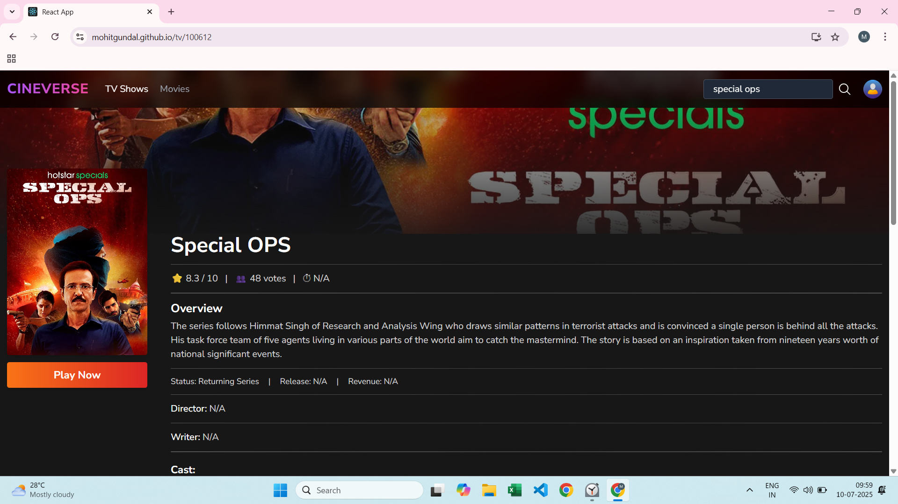
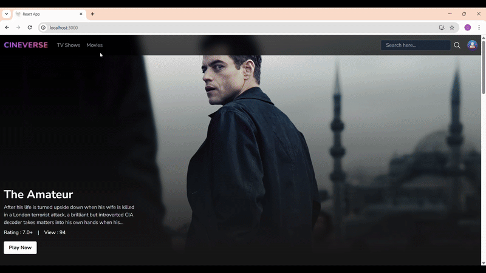

## 🎬 Cineverse - Discover, Explore & Watch


Cineverse is a powerful React-based movie and TV show web app that lets you explore trending content, search across genres, view detailed pages, and get intelligent recommendations. Powered by the TMDb API and designed with a modern, responsive UI, Cineverse gives you a Netflix-style experience without leaving your browser.

---

## 🚀 Features
- 🎥 Trending Banner Carousel: View weekly trending shows/movies in a sleek auto-playing banner.
- 🔍 Smart Search: Real-time search with results across movies and TV shows.
- 📺 Explore by Category: Discover content via /movie or /tv routes.
- 🎯 Detailed Pages: View full info, backdrop, poster, rating, overview, and related recommendations.
- 🤝 Recommendations: Auto-suggested similar content on detail pages.
- 📱 Mobile-Friendly UI: Fully responsive layout with custom mobile navigation.
- 🌀 Global Loader & Skeletons: Smooth transitions and feedback on slow networks.
- 🔁 Infinite Scroll: Seamless loading of more content without page reload.

---

## 🌐 Live Demo
👉 [Launch Cineverse](https://your-demo-link.netlify.app)

---

## 📸 Screenshots

### 🏠 Home with Banner


### 🔍 Search Results


### 🎬 Details Page


---

## 🎥 Demo in Action


---

## 🛠 Tech Stack

- **React.js** – UI framework
- **React Router** – SPA navigation
- **Redux Toolkit** – Global state management
- **Tailwind CSS** – Utility-first CSS for responsive UI
- **Axios** – API requests
- **TMDb API** – Data source for movies/TV

---

## 📥 Getting Started

1. **Clone the repository:**

```bash
git clone https://github.com/mohitgundal/cineverse.git
```


2. **Navigate to the project folder:**

```bash
cd cineverse
```

3. **Install dependencies:**

```bash
npm install
```

4. **Create .env file and add your TMDB API key:**

```bash
REACT_APP_API_KEY=your_tmdb_api_key
```

5. **Run the development server:**

```bash
npm start
```

---

## 📁 Folder Structure
```plaintext
cineverse/
├── public/
├── src/
│   ├── assets/       # Logo, icons, images
│   ├── components/   # Header, Footer, Loader, etc.
│   ├── pages/        # Home, Search, Explore, Details
│   ├── store/        # Redux slices
│   ├── App.js        # Root component
│   ├── index.js      # Entry point
├── .env              # Environment variables
├── package.json      # Project metadata and dependencies
└── README.md         #This file
```

## 📌 How to Use

- Visit homepage to explore trending content.
- Use the search bar to find any movie or TV show.
- Click on a card to view detailed info and recommendations.
- Scroll to load more content in explore/search pages.
- Enjoy the responsive experience on any device.

---

## 🤝 Contribution
Contributions are welcome!
- 🍴 Fork the repo
- 🔧 Create your feature branch (git checkout -b feature/AmazingFeature)
- ✅ Commit your changes
- 📩 Submit a pull request
Found a bug or want a new feature? Open an issue!

---

## 📄 License
Licensed under the MIT License – see the LICENSE file for details.


## 🙋‍♂️ Author  
Made with ❤️ by **Mohit Gundal**
Let’s connect: 

📫 [LinkedIn](https://www.linkedin.com/in/mohitbuilds/) • 🌐 [mohitbuilds.com](https://mohitbuilds.com) • 📷 [Instagram](https://www.instagram.com/_mohitbuilds/)


## 🙏 Thank you for visiting!
If you found this project helpful, consider giving it a ⭐ on GitHub — it helps a lot!
Issues and feature ideas are also appreciated.
